## Oppgave 1 - DevOps-prosess for team

### 1. Branch-strategi

Teamet bruker branch-strategi inspirert av Git-flow. 
`main`-branchen representerer produksjonsklar kode og skal alltid være stabil. 
All utvikling skjer i egne `feature-branches` som opprettes fra `main`.

#### Ny branch opprettes for hver oppgave eller feature:

Eksempel:
- `feature/docker-multistage-build`
- `feature/controller-quizService`

Direkte commit til `main` er ikke tillatt.

#### Navngivning av branches:
- `main` - Produksjonsklar kode
- `feature/<beskrivelse>` - Nye funksjoner
- `fix/<beskrivelse>` - Bug fixes
- `hotfix/<beskrivelse>` - Kritiske produksjonsrettelser

Branches merges kun via Pull Request
- - - 
### 2. Pull Request-prosess

#### Pull Request opprettes når en selvstendig oppgave er ferdig utviklet og klar for gjennomgang.

1. Utvikler oppretter en branch fra `main`.
2. Endringer implementeres og commits pushes til GitHub.
3. Pull Request opprettes mot `main`.
4. CI-pipeline kjører automatiske tester, build og sikkerhetsskanning.
5. Koden gjennomgås av minst en annen utvikler.
6. Eventuelle kommentarer eller forbedringer implementeres.
7. Når alle krav er oppfylt, merges PR til `main`.

#### Minst en utvikler må godkjenne Pull Request før merge.
Ved større endringer eller arkitekturvalg skal Tech Lead involveres.
Code review skal fokusere på:
- Lesbarhet og struktur
- Overholdelse av prosjektets standarder.
- Sikkerhet og robusthet
- Potensielle edge cases.

#### Før en Pull Request kan merges må følgende krav være oppfylt:
- Alle automatiske tester må bestå
- Docker build må lykkes
- Trivy må ikke rapportere HIGH eller CRITICAL sårbarheter.
- Minst en godkjenning fra annen teammedlem
- Ingen åpne, kritiske review-kommentarer.

- - -

### Branch Protection

`main`-branchen er beskyttet med følgende regler:
- Krev Pull Request før merge
- Krev godkjent code review
- Krev at alle status checks (CI pipeline) består
- Forhindre direkte push

#### Branch protection regler for `main` er konfigurert med:

- Required Pull Request before merge
- Required status checks
- Required conversation resolution
- No direct push allowed
- Administrators cannot bypass rules

#### Dette sikrer at ingen kan omgå kvalitetssikring, og at produksjonskoden alltid holder høy standard

- - -

### Automatisering

Hvilke automatiske sjekker skal kjøres?

#### På Pull Request kjøres:

- `mvn test`
- `mvn package`
- Docker build
- Trivy filesystem scan
- Trivy container image scan
- Generering og opplasting av SARIF-rapport til GitHub Security.

Pipeline feiler dersom det oppdages HIGH eller CRITCAL sårbarheter.

#### På push til `main` kjøres:

- Tester og build
- Docker image build 
- Push til Docker Hub
- Tagging med commit SHA og `latest`

Denne automatiseringen sikrer kontinuerlig kvalitet, rask tilbakemelding og trygg deply-prosess.

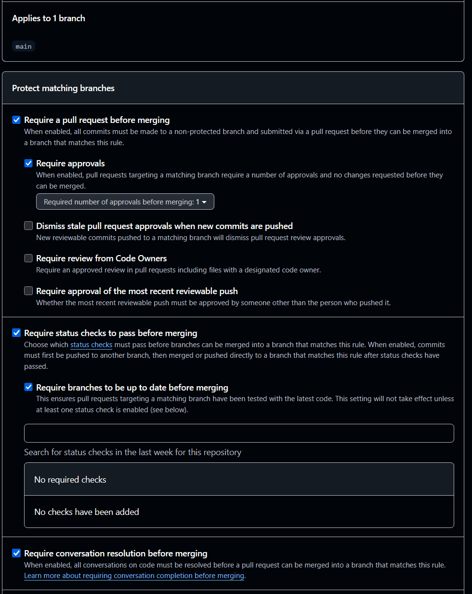
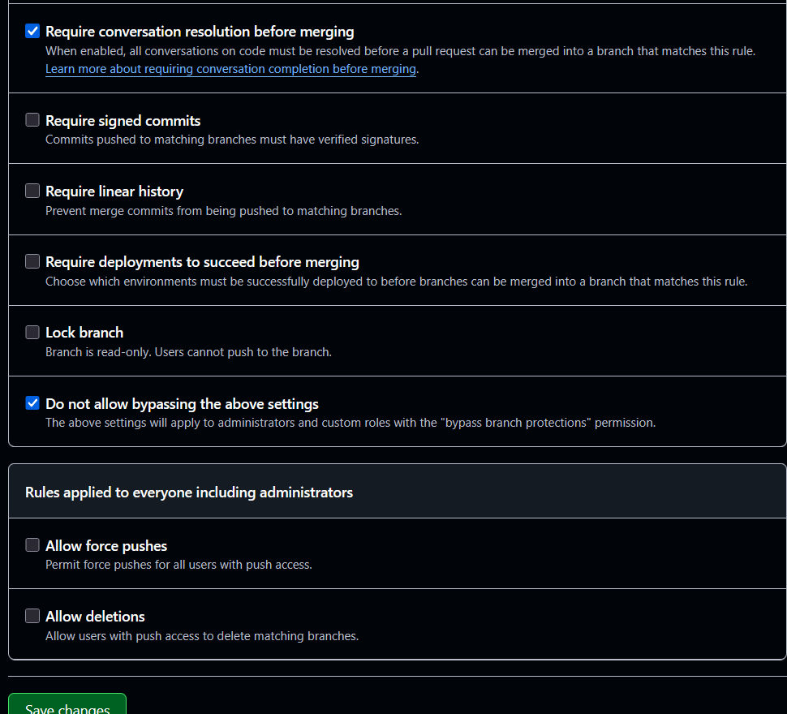

- - -

## Oppgave 2

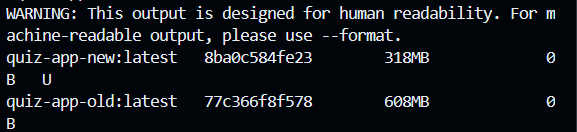
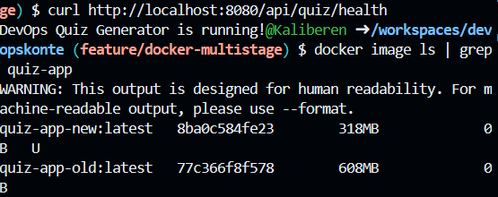

#### Før

- quiz-app-old
- 608MB

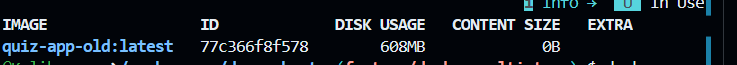

#### Etter

- quiz-app-new
- 318MB

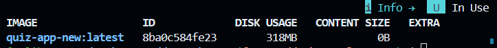

- - -

## Oppgave 3.

Mislykket workflow på main (med docker push) 

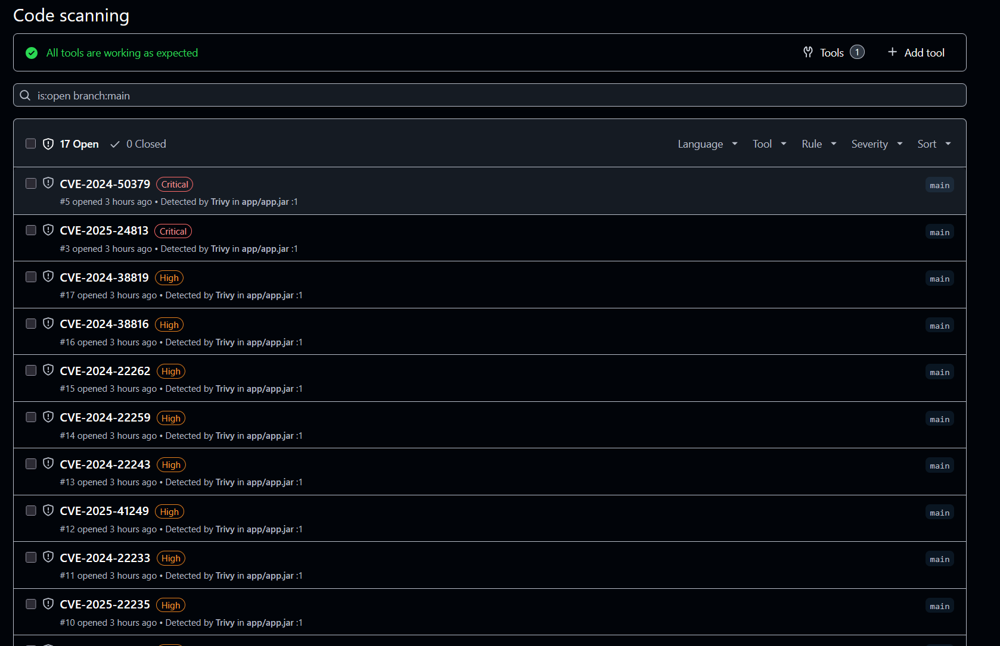

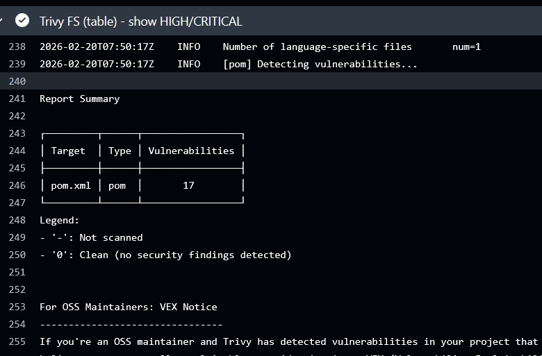

github action runs
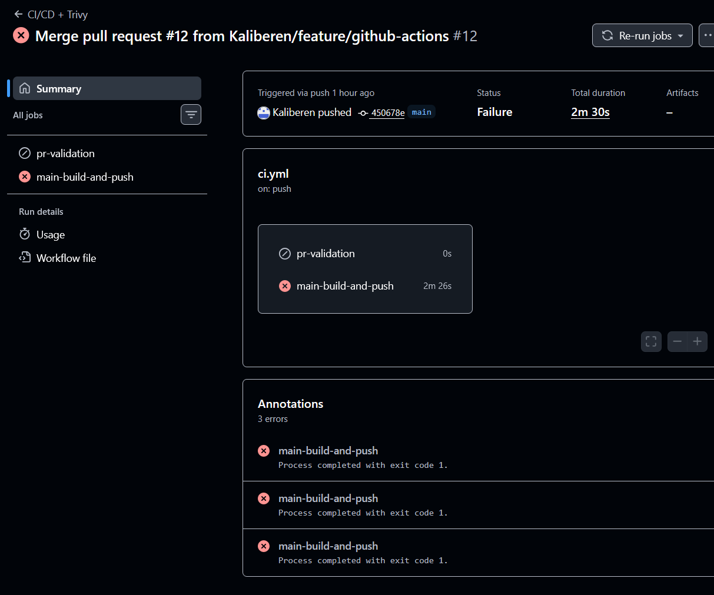

alle sjekkpunkter

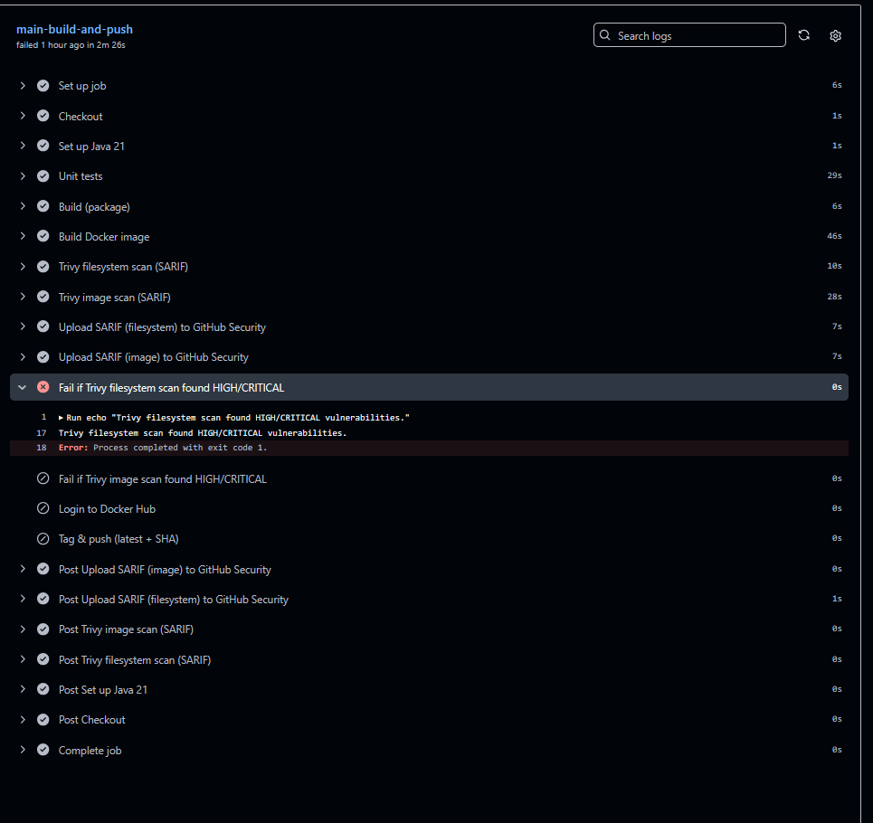

code scanning
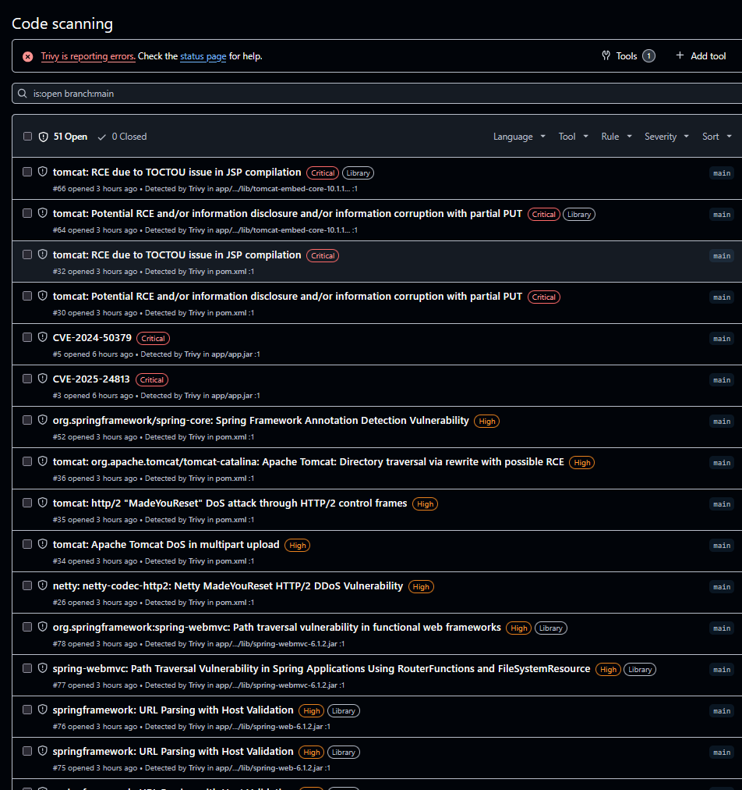

Oppgave 4 
m student innen IT og programmering har jeg opplevd hvordan AI-verktøy som ChatGPT og GitHub Copilot kan øke produktiviteten dramatisk. I dette prosjektet brukte jeg AI til å generere deler av CI/CD-workflowen, forbedre Dockerfile og forstå hvordan Trivy kunne integreres i GitHub Actions. Det gjorde at jeg kunne komme raskere frem til en fungerende løsning enn jeg ellers ville gjort alene. Samtidig erfarte jeg tydelig hvorfor DevOps-prinsipper blir enda viktigere når AI øker utviklingshastigheten.

AI kan generere kode raskt, men den garanterer ikke kvalitet eller sikkerhet. I mitt prosjekt fungerte applikasjonen teknisk sett, men Trivy oppdaget flere HIGH og CRITICAL sårbarheter i dependencies som Spring Boot og Tomcat. Dette viste meg at selv om AI hjelper meg å skrive kode raskere, må jeg fortsatt forstå hva som faktisk kjøres i produksjon. DevOps-praksis som automatiserte tester, Docker-build og sikkerhetsskanning fungerte som en kvalitetssikring av både min egen og AI-generert kode.

Som IT-programmererstudent har jeg også lært at struktur er avgjørende i teamarbeid. Gjennom branch-strategi, Pull Requests og branch protection-regler opplevde jeg hvordan DevOps skaper trygghet og forutsigbarhet. Ingen kode kunne merges til main uten at tester, build og sikkerhetsskanning var vellykket. Dette ga en profesjonell arbeidsflyt som ligner det man møter i arbeidslivet. AI kan hjelpe med å skrive kode, men det er DevOps som sikrer at koden faktisk er produksjonsklar.

En annen viktig lærdom for meg er hvordan DevSecOps blir en naturlig del av utviklingsprosessen. Tidligere kunne sikkerhet føles som noe som kom til slutt. I dette prosjektet var sikkerhet integrert i pipeline gjennom Trivy. Når pipeline feilet på grunn av sårbarheter, ble jeg tvunget til å oppgradere dependencies og forbedre Docker-imaget. Dette gjorde meg mer bevisst på ansvar som utvikler. AI kan foreslå løsninger, men jeg må forstå og validere dem.

AI gjør meg mer effektiv som student og fremtidig utvikler. Jeg kan lære raskere, eksperimentere mer og løse problemer mer effektivt. Men nettopp fordi tempoet øker, blir behovet for kontroll større. DevOps gir den kontrollen gjennom automatisering, standardisering og kontinuerlig kvalitetssikring.

For meg har dette prosjektet vist at AI og DevOps ikke konkurrerer – de utfyller hverandre. AI øker produktiviteten min som utvikler, mens DevOps sikrer at produktiviteten ikke går på bekostning av kvalitet, stabilitet og sikkerhet. I fremtidig arbeid som IT-programmerer vil kombinasjonen av AI-kompetanse og solid DevOps-forståelse være avgjørende for å levere robuste og sikre løsninger.